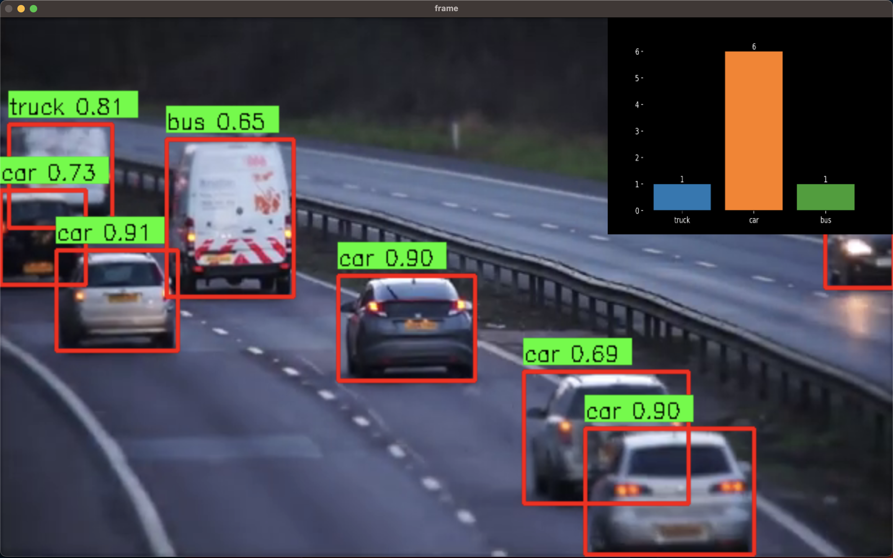

# Real-Time Vehicle Detection and Analysis with YOLOv8

This project implements a real-time vehicle detection, counting, and analysis system using YOLOv8. It processes video inputs to detect vehicles, counts them, and visualizes the results with a bar plot.

## Features

- **Vehicle Detection:** Identifies and annotates vehicles in video frames.
- **Real-Time Counting:** Keeps track of the number of detected vehicles.
- **Analytics Visualization:** Generates and displays real-time analytics using bar plots.
- **Integration:** Combines detection frames with analytics for a unified view.

## Requirements

- Python 3.7+
- OpenCV
- NumPy
- Ultralytics YOLOv8


## Installation

1. **Clone the Repository:**
   ```bash
   git clone https://github.com/yourusername/vehicle-detection-analysis.git
   cd vehicle-detection-analysis
   ```

2. **Install Dependencies:**
   ```bash
   pip install opencv-python numpy ultralytics
   ```

3. **Download YOLOv8 Model Weights:**
   - Place your YOLOv8 weights file (e.g., `yolov8s.pt`) in the project directory or update the model path in the code.

## Usage

1. **Prepare Your Video:**
   - Place your video file in the project directory or provide the path to the video file you want to analyze.

2. **Run the Application:**
   ```bash
   python main.py
   ```

   
   ```bash
   python vehicle_detection.py
   ```

3. **View Results:**
   - The application will open a window displaying the real-time video with detected vehicles and analytics. Press 'q' to exit the video window.

## Code Explanation

### `Analyse` Class

- **`__init__`**: Initializes the class with default values for counting and video writing.
- **`Yolo_model`**: Loads the YOLOv8 model from the specified path.
- **`setup_frame_and_ultralytics`**: Sets up video capture and retrieves video properties.
- **`yolo_analytics`**: Updates the analytics with the current class-wise count and visualizes it using a bar plot.
- **`process_frame`**: Processes each video frame for object detection and updates counts.
- **`combined_result_frame`**: Combines the detection frame with the analytics frame for display.
- **`run`**: Main method to process the video, detect vehicles, and show results.

## Example

The provided script initializes the `Analyse` class, loads the YOLOv8 model, and processes a video file named `vid.mp4` for vehicle detection and analysis.

```python
if __name__ == "__main__":
    file = "vid.mp4"
    model = Analyse()
    model.run(video_path=file)
```

## Contributing

Feel free to fork this repository and submit pull requests. For any issues or feature requests, please open an issue on GitHub.

## Contact

If you have any questions or suggestions, feel free to contact me at danielsamueletukudo@gmail.com and on linkedin@ https://www.linkedin.com/in/daniel-etukudo

## License

This project is licensed under the MIT License. See the [LICENSE](LICENSE) file for details.
